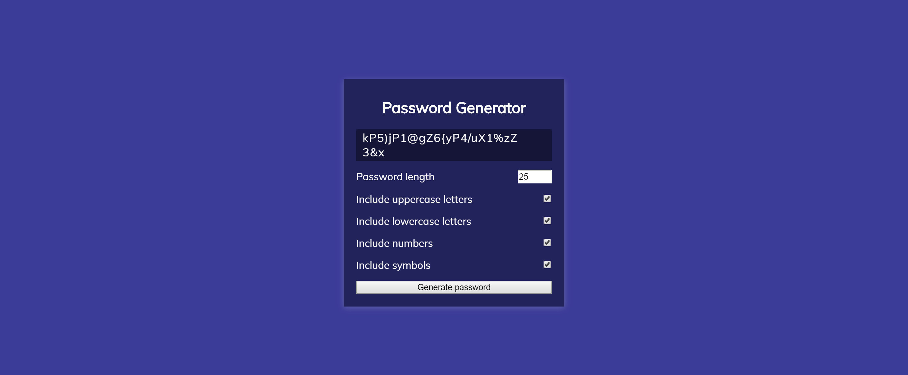

# Password-Generator
    Blake Thompson
# Useage
1. Client will be able to create a safe and sercure password
2. Client has option on how long they'd like genereated password to be.
3. Client will have options as to whether or not they'd like lowercase letters.
4. Client will have options as to whether or not they'd like uppercase letters.
5. Client will have options as to whether or not theyd like numbers.
6. Client will have options as to whether or not they'd like symbols.
7. Client is then ready to generate
8. Password will be shown through an alert then displayed on the output field aswell

# Visuals

# Links

https://github.com/fleshborne/Password-Generator

https://fleshborne.github.io/Password-Generator/

https://net-comber.com/charset.html
